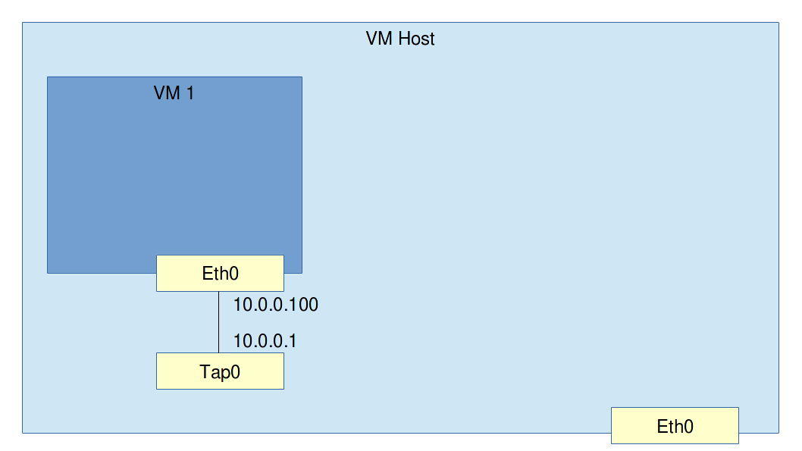

# Set up a VM with an L1 connection to the host

Requirements: A linux machine. This can be a VM.

### Exercise: L1 connection to a VM



**Assignment**: Start a VM and create an L1 connection between it and the host. Assign an IP address to the tap0 interface on the host and the eth0 on the VM. Ping from the host to the VM and from the VM to the host.

#### Little help

* You can start a VM (or Linux container rather) matching the assignment using LXC. Containers are very lightweight and can easily run inside VMs themselves. The [OpenVNet installation guide](http://openvnet.org/installation/#install-lxc) has a good example of how to do it. Just do the steps from [Install LXC](http://openvnet.org/installation/#install-lxc) up to and including [Apply Network interface settings](http://openvnet.org/installation/#apply-network-interface-settings).

* You can alternatively start a VM using KVM. If your Linux host machine is a VM, you will need to make sure you can use nested virtualization. Here's an example KVM command.

```
qemu-system-x86_64 -m 1024 \
                   -cpu host \
                   -hda /path/to/vm/image \
                   -net nic,macaddr=52:54:00:12:34:70 \
                   -net tap,script=ifup.sh,downscript=no
```

* Both the above KVM command and the LXC setup in the OpenVNet installation guide will create a `tap0` interface on the host. This is a virtual network interface card that behaves exactly as a real NIC. You will see it using the `ip addr show` command and you can assign IP addresses to it using `ip addr add`. It is connected directly to the VM's eth0 NIC. This means it behaves as if there's a network cable with one end plugged into the VM's eth0 and the other end into the host's tap0.

* While you can technically do the same thing with Oracle's virtualbox, I do not recommend it for this example. Vbox uses its own bridging and we will use the Linux bridge to set up bridged networking ourself in the next examples.

#### Remark

We have effectively set up an L1 network connection between the VM and the host. Why do we need to assign an IP address which is L3? The reason is we are using ping which is ICMP. ICMP is an L4 protocol so it relies on all layers beneath it. That's why we have to set up as far as L3.
