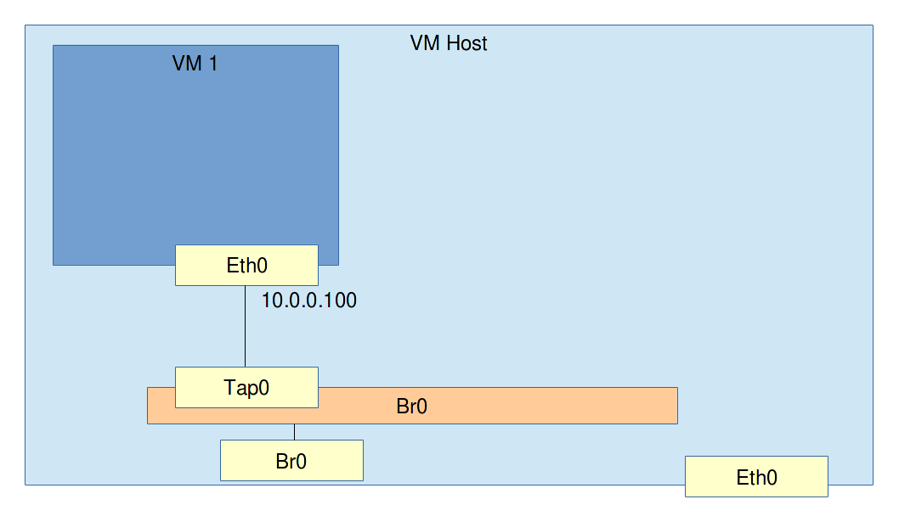

# Setting up bridged networking

Requirements: The Linux machine and VM from the last exercise.

### Exercise: Creating a Linux bridge

Now we are going to create a *bridge* on our VM host. As you might remember from the osi model document, a bridge is an L2 device. It has multiple ports in which you can insert network cables which are then connected to machines. When the bridge receives an ethernet frame on a port, it broadcasts the frame on every other port.

During the course of these exercises, we will refer to the sockets to put in cables on the Bridge as *ports* and the cable sockets on machines on the other end as *NICS*.

The Linux kernel comes with a bridge of its own. In fact some network hardware you can buy is actually running Linux with the very bridge module we're going to use here.

Install the bridge by using the command `brctl addbr br0`. You will need to make sure the brctl command is installed. It's usually in a package called `bridge-utils`.

This command does 2 things and it's a little confusing.

* It creates a bridge called br0

* It adds a virtual NIC to the host also called br0 which is connected to a port on the bridge br0.

**Assignment**: Create the Bridge. Check if it exists by using `brctl show br0` Also check if the newly created NIC exists by typing `ip addr show br0`.

### Exercise: Turn a NIC no the VM host into a port of the bridge

One neat thing about the Linux bridge is that any NIC on the host can be turned into a port on the bridge.

Turn `tap0` to a bridge port using `brctl addif br0 tap0`. If things went right you should now see tap0 under interfaces when doing `brctl show br0`. Are you still able to ping the VM? If you still can, you did something wrong. :p

The reason why ping no longer works is because `tap0` is no longer a *NIC* on the host. There is still a "cable" between the VM's `eth0` and the host's `tap0` but `tap0` is now a *port* on the bridge. All the bridge does take ethernet frames that come in one port and broadcast it out of all other ports.

**Assignment**: Figure out how to enable the host to ping the VM again.

#### Little help

* Make sure that any NICs or ports you're using are up. If for example `ip addr show br0` shows *state DOWN*, bring it up using `ip link set br0 up`. Make sure all NICs/ports you expect to use are up.

**Assignment**: Add a second VM to the bridge. The host and the two VMs should all be able to ping each other.

**Extra assignment**: Assuming the VM host has an IP address on its `eth0` NIC that it got through DHCP, how could the VMs get an IP address from DHCP as well? Remember that a Bridge essentially broadcasts all traffic to all its ports and that any NIC (except for wifi NICs like wlan0) on the host can be turned into a port. 
