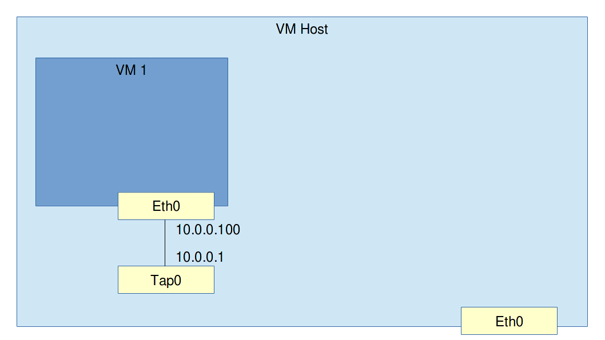

# Set up bridged networking for VMs

Requirements: A linux machine. This can be a VM.

### Exercise: L1 connection to a VM

**Assignment**: Start a VM and create an L1 connection between it and the host. Assign an IP address to the tap0 interface on the host and the eth0 on the VM. Ping from the host to the VM and from the VM to the host.
