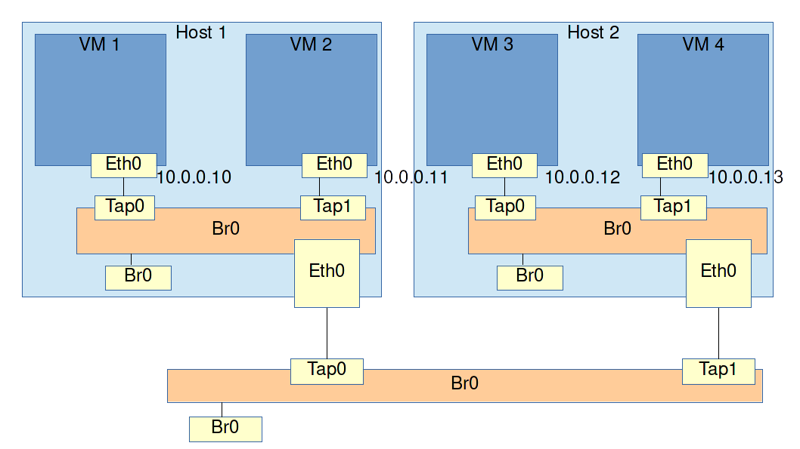

# Networking with multiple hosts and bridges

### Exercise: Multiple hosts, VMs and bridges

Now that we're familiar with bridged networking, the next exercise is to create a single L2 subnet that spans multiple bridges and multiple VM hosts.

Remember that a bridge is an L2 device that receives an Ethernet frame on one port and sends it out every other port. That means that connecting multiple bridges together has pretty much the same effect as using one larger bridge with more ports.

**Assignment**: Create 2 VM hosts with 2 VMs each. Create a bridge on each host and connect the VMs to it. Now connect the VM hosts themselves to a bridge as well. This effectively puts the 4 VMs together in one L2 subnet. All 4 VMs should be able to ping each other.

#### Remark

* If your VM hosts are themselves VirtualBox or VMWare machines, both VirtualBox and VMware have their own internal implementation of bridged networking. It can be set in the VM's settings in their respective GUIs.

  Tip: If you are using a VM with NAT networking, there is no need to remove it. You can just add a second NIC to your VM that uses bridged networking instead.

* If your VM hosts are physical machines, you will need to connect them to either a physical bridge or you could connect them together directly using a cable.

* If your VM hosts are KVM machines on a Linux system, you can set up bridged networking manually in the exact same way you did it in the last exercise.

#### Tip

* If things don't work as expected, look at the picture and ask yourself which path you expect network traffic to take through the topology. Then use `tcpdump` to check each NIC and port one by one. That way you can see at exactly what point things go wrong.
