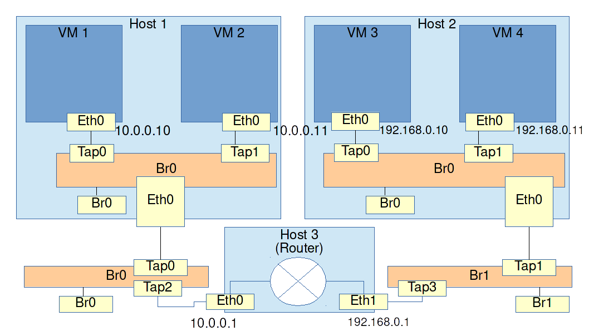

# L3 routing

Requirements: The setup from the last exercise

### Exercise: Set up a third host to act as a router

By this point you should have a firm grasp of setting up VMs and attaching them to bridges. The next step is to take it up the the 3rd layer of the OSI model. The purpose of L3 is to connect multiple subnets. It allows us to have networks that are too large to broadcast everything on L2 such as the internet.

We are going to take the result of the [previous exercise](03_multiple_hosts_vms_and_bridges.md), put the 4 VMs in two different subnets and then set up a third host to act as a router.



VM1, VM2 and the router will be together in subnet `10.0.0.0/24`

* VM1: 10.0.0.10
* VM2: 10.0.0.11
* Router: 10.0.0.1

VM3, VM4 and the router will be together in subnet `192.168.0.1/24`

* VM3: 192.168.0.10
* VM4: 192.168.0.11
* Router: 192.168.0.1

All 4 VMs should be able to ping each other.

#### Tips

* Before sending anything out a NIC, the OS will check its routing table. This is where it is written which routes can be taken to different subnets. You will need to manually make an entry in the routing tables of each VM

* The router can be a simple Linux machine with IP forwarding enabled. To check if this is enabled, use the following command.

```
sysctl net.ipv4.ip_forward
```

If the above command tells you that it's set to 0 and thus turned off, turn it on with the following command.

```
sysctl -w net.ipv4.ip_forward=1
```

To make the change persistent after reboot, open the file `/etc/sysctl.conf` and set it to 1 in there.

* If things don't work as expected, look at the picture and ask yourself which path you expect network traffic to take through the topology. Then use `tcpdump` to check each NIC and port one by one. That way you can see at exactly what point things go wrong.
